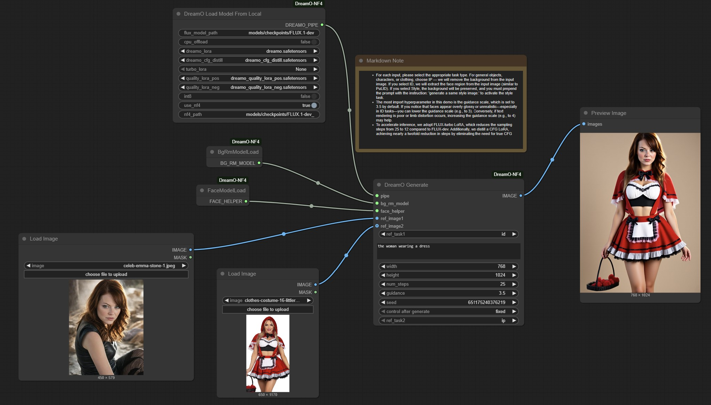

# ComfyUI-DreamO-NF4

Wrapper for [bytedance's DreamO](https://github.com/bytedance/DreamO) in ComfyUI.

NF4 version is a simple fix that skips the 4–5 minute quantization startup time in the original version.  
It runs on 24GB VRAM.

### Download models:
```bash
huggingface-cli download black-forest-labs/FLUX.1-dev --local-dir models/checkpoints/FLUX.1-dev --exclude "flux1-dev.safetensors"

huggingface-cli download priyesh17/FLUX.1-dev_Quantized_nf4 --local-dir models/checkpoints/FLUX.1-dev_Quantized_nf4

wget -O models/loras/dreamo.safetensors "https://huggingface.co/ByteDance/DreamO/resolve/main/dreamo.safetensors?download=true"

wget -O models/loras/dreamo_cfg_distill.safetensors "https://huggingface.co/ByteDance/DreamO/resolve/main/dreamo_cfg_distill.safetensors?download=true"

wget -O models/loras/FLUX.1-Turbo-Alpha.safetensors "https://huggingface.co/alimama-creative/FLUX.1-Turbo-Alpha/resolve/main/diffusion_pytorch_model.safetensors?download=true"
```



